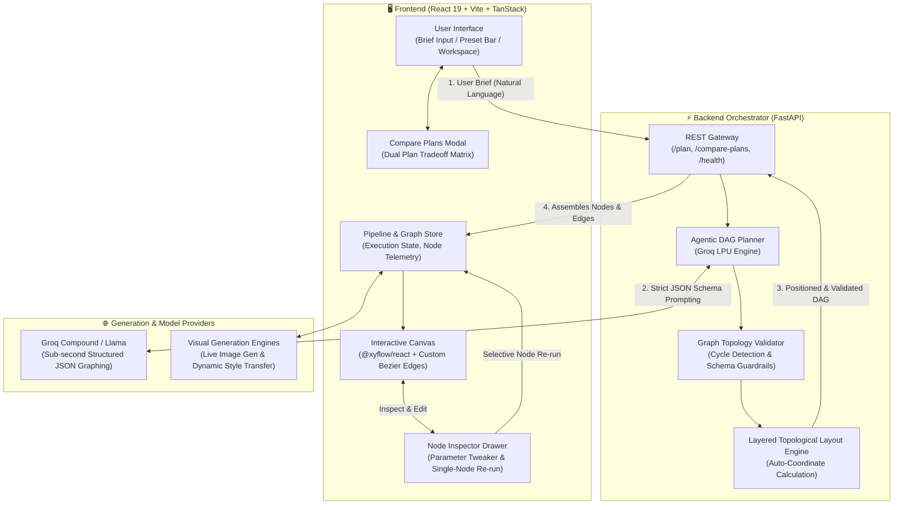
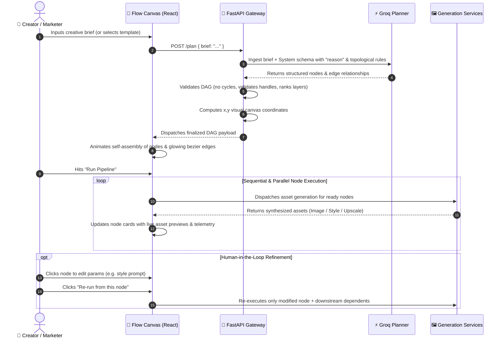

<div align="center">

# 🌊 Flow — Agentic Workflow Builder
### *Natural Language to Self-Assembling Creative Pipelines for HexCoded*

[](https://fastapi.tiangolo.com)
[](https://react.dev)
[](https://reactflow.dev)
[](https://groq.com)
[](https://tailwindcss.com)

**Say what you want to create in plain English. Watch an optimized, multi-stage production graph architect itself on screen, run real generative pipelines, and let you tweak every detail on the fly.**

[The Big Idea](#-the-big-idea-what-we-built) • [How It Works](#-how-it-works-in-human-terms) • [Architecture](#-system-architecture) • [HexCoded Alignment](#-strategic-fit-how-flow-powers-hexcodedai) • [Long-Term Business Impact](#-long-run-value-revenue-traction--market-moat) • [Quickstart](#-getting-started)

---

</div>

## 💡 The Big Idea: What We Built

Most AI creative tools today fall into one of two extremes:
1. **The "Slot Machine" Prompt Box:** You type a prompt, pray, and get a single flattened image or video back. If the lighting is off or the logo is wrong, your only choice is to reroll and lose everything. Zero control, zero repeatability.
2. **The "Spaghetti Monster" Node Canvas (ComfyUI, WebUIs):** You have total control, but you need an engineering degree to manually wire 35 nodes, adjust latent tensors, configure CFG scales, and troubleshoot broken bezier handles. Creative directors and performance marketers run away screaming.

### **Flow bridges this gap completely.**

You type a one-line creative goal — like *"Product photo of an organic cold brew bottle into a 5-scene summer social ad with moody cafe lighting"* — and hit enter. 

Within milliseconds, an **autonomous planning agent** breaks your vision down into its fundamental creative steps: prompt expansion, image synthesis, style application, upscaling, and final master delivery. It constructs a **Directed Acyclic Graph (DAG)**, calculates optimal topological coordinates so wires never cross or tangle, and **animates the self-assembly of the entire pipeline right before your eyes**.

From there, you're not locked in: you can click any node, tweak prompts or parameters, see real-time estimated cost and latency telemetry, run live dual-asset generation, or compare alternative production paths side-by-side.

---

## ✨ What Makes Flow Special (In Plain English)

### 1. 🧠 Instant AI Graph Architecture
Instead of you manually hunting for nodes and connecting inputs to outputs, an LLM orchestrator (powered by Groq for sub-second responses) acts as your senior technical director. It decides:
- Which specialized steps are needed (e.g. *Input → Prompt Expansion → Parallel Image Gen + Style Transfer → Upscale → Master Output*).
- Which operations can run concurrently in parallel branches versus which must wait for upstream dependencies.
- How to layout the graph cleanly across layers so your canvas stays crisp and readable.

### 2. 🔍 Built-in Explainability ("Why This Graph?")
Black-box AI creates skepticism. Flow introduces explicit architectural transparency:
- Every node carries an LLM-generated **architectural rationale** (e.g. *"A separate style transfer pass is split here to enforce brand color palette adherence before upscaling"*).
- Hover over any node or inspect it in the sidebar to understand *why* the agent structured the pipeline that way. Creative teams stay in the driver's seat.

### 3. 🎨 Live Dual Asset Generation (No Mock Badges)
This isn't a wireframe mockup. Flow executes real visual pipelines:
- **Image Generation Nodes** connect live to image synthesis models to render dynamic visuals tailored to the prompt.
- **Style Transfer Nodes** execute dynamic visual filters and style transformations directly on upstream visual assets.
- Live asset previews populate directly inside the canvas cards as each execution stage completes.

### 4. 🎛️ In-Place Surgical Editing & Selective Re-run
Found a typo or want to swap "neon cyberpunk" for "warm golden hour"?
- Click any node to open the **Node Inspector**.
- Modify prompts, aspect ratios, or model params.
- Hit **Re-run from this node**: Flow intelligently recalculates downstream nodes without forcing you to re-plan or re-run the entire pipeline from scratch.

### 5. ⚖️ Strategic Plan Comparison
Should you take the quick 3-step shortcut or run a high-fidelity 6-step cinematic pipeline?
- The **Compare Plans** modal lets you view your Default Agentic Graph side-by-side with a Streamlined Direct Path.
- Compare estimated time, cost, and complexity tradeoffs before committing GPU compute.

### 6. 🛡️ Bulletproof Production Resilience
- **Self-Healing Fallbacks:** If the live LLM planner is ever unreachable or rate-limited, client-side topological fallbacks ensure the canvas never crashes or leaves the user stranded.
- **Simulate Failure & Retry Recovery:** Built-in dev affordances let you simulate node timeouts and execute one-click retry recovery to test real-world error states gracefully.

---

## 🏛️ System Architecture

Flow is architected as an ultra-responsive decoupled system: a high-throughput **FastAPI backend orchestrator** handling graph intelligence, and a fluid, GPU-accelerated **React 19 + @xyflow canvas frontend**.



### 🔄 End-to-End Pipeline Execution Lifecycle



---

## 📁 Repository Structure

```
flow-builder/
│
├── README.md                      # Complete project documentation & business strategy
│
├── backend/                       # High-performance Python FastAPI orchestrator
│   ├── main.py                    # API router, CORS middleware & health check
│   ├── planner.py                 # Groq LPU integration, JSON schema prompts & fallback graphs
│   ├── validator.py               # Graph validation, cycle detection & node sanity checks
│   ├── layout.py                  # Topological layered layout engine for coordinate positioning
│   ├── models.py                  # Pydantic schemas for DAG nodes, edges, and payloads
│   ├── test_backend.py            # Automated test suite for backend planning & validation
│   └── requirements.txt           # Python dependencies (fastapi, groq, pydantic, uvicorn)
│
└── frontend/                      # Frontend creative workspace (React 19 + @xyflow/react)
    ├── src/
    │   ├── components/
    │   │   ├── flow/              # Core canvas components
    │   │   │   ├── Workspace.tsx  # Central orchestrator: canvas, chat, sidebar, execution loop
    │   │   │   ├── Canvas.tsx     # @xyflow/react canvas with custom bezier edges & controls
    │   │   │   ├── FlowLogo.tsx   # HexCoded branded logo component
    │   │   │   ├── NodeInspector.tsx # Real-time node telemetry, parameter editor & re-runner
    │   │   │   ├── ComparePlansModal.tsx # Side-by-side plan tradeoff comparison
    │   │   │   ├── TemplatesDrawer.tsx # 6 pre-built production workflow presets
    │   │   │   └── CustomNodes.tsx    # Branded node cards (Input, ImageGen, Style, Output)
    │   │   └── ui/                # Accessible Radix UI primitives & design tokens
    │   ├── lib/
    │   │   ├── flow-api.ts        # Client-side backend connector & error boundary
    │   │   └── flow-schema.ts     # Frontend TypeScript types and default state definitions
    │   └── routes/                # TanStack application routing
    ├── package.json               # Frontend dependencies & scripts
    └── vite.config.ts             # Vite configuration with TailwindCSS v4
```

---

## 🎯 Strategic Fit: How Flow Powers HexCoded.ai

**HexCoded.ai** is pioneering the future of automated, studio-grade creative production and agentic marketing systems. Its mission is to empower brands, agencies, and digital creators to generate high-performing ads, brand visuals, and multi-channel campaigns without spending hundreds of thousands of dollars on fragmented production agencies.

Here is how Flow sits at the absolute core of HexCoded's vision:

| HexCoded Strategic Need | How Flow Solves It |
| :--- | :--- |
| **From Prompt Box to Enterprise Tool** | Enterprise clients cannot run multimillion-dollar brand campaigns on single text prompts. Flow turns HexCoded into an **inspectable, auditable workflow engine** where brand rules, style guides, and staging are visible. |
| **Model-Agnostic Creative Layer** | Foundation models (Midjourney, FLUX, Stable Diffusion, Runway, Kling, Sora) change every few months. Flow acts as the **orchestration operating system** — the graph topology stays stable even as backend models evolve. |
| **Human-in-the-Loop Brand Safety** | Creative directors refuse full black-box autonomy. Flow gives them a self-assembling plan, but lets them tweak node prompts, review why steps exist, and selectively re-run outputs before spending compute. |
| **Complex Multi-Asset Campaigns** | Real advertising isn't one image. It's a 16:9 hero shot, 9:16 vertical reels, lifestyle carousels, and localized banners. Flow's DAG branching natively manages parallel multi-format outputs from a single source asset. |

---

## 📈 Long-Run Value: Revenue, Traction & Market Moat

Flow is not just a flashy UI demo — it is a **foundational growth and revenue driver** for HexCoded in the long run:

### 1. 💰 Revenue Expansion
* **Tiered Compute & Orchestration Margin:**
  Instead of charging a flat $20/month subscription (which leaves money on the table when power users burn GPU cycles), Flow naturally tracks per-node compute costs, latency, and tokens. HexCoded can monetize on a transparent credit or usage-based model with built-in 40–60% margins on underlying model inference.
* **Enterprise Custom DAG Licensing:**
  Large brands (e.g. e-commerce retailers, global agencies) require standardized creative workflows (e.g. *"Clean white background → Remove reflections → Apply localized holiday branding → Output 12 aspect ratios"*). HexCoded can package and license proprietary enterprise pipelines for $2,000–$10,000/month.
* **Workflow Template Marketplace:**
  Create an ecosystem where elite creators, agency art directors, and prompt engineers build and sell verified agentic pipelines, with HexCoded taking a 20–30% platform rake.
* **Headless B2B API (Programmatic Ad Generation):**
  Developers can trigger saved Flow graphs via REST endpoints (`POST /api/v1/pipelines/{id}/execute`) to generate 10,000 personalized ad creatives for dynamic Facebook or Google Ad campaigns.

### 2. 🚀 Organic Traction & Virality
* **The "Magic Moment" Demo Loop:**
  In generative AI, interfaces that animate the creation of something complex are inherently viral. Screen recordings of a single prompt automatically assembling into an interconnected, glowing DAG are tailor-made for Twitter/X, LinkedIn, and YouTube tech audiences.
* **Frictionless Top-of-Funnel Onboarding:**
  Beginners who are intimidated by node editors get the instant gratification of typing a prompt and seeing a professional workflow built for them. The learning curve drops from weeks to seconds.

### 3. 👥 Consumer & Enterprise Base Expansion
* **Democratizing Technical Agency Power:**
  Flow allows a solo growth marketer or non-technical founder to operate with the throughput of a 5-person agency production team.
* **Cross-Functional Team Collaboration:**
  Copywriters, brand managers, and designers can collaborate on the same visual canvas. The copywriter tweaks the prompt node, the designer inspects the style transfer node, and the manager reviews the output.

### 4. 🏰 Defensible Business Moat (High Retention & Switching Costs)
* **Workflow Lock-In vs. Model Commoditization:**
  If HexCoded were just a wrapper around an image API, any customer could leave for a cheaper wrapper tomorrow. When customers build, refine, and store **dozens of proprietary agentic DAG pipelines** inside HexCoded to run their everyday marketing operations, the switching cost becomes nearly insurmountable. Flow transforms HexCoded into an indispensable **system of record for creative production**.

---

## 🚀 Getting Started

Follow these steps to spin up both the FastAPI backend orchestrator and the React 19 frontend workspace locally.

### Prerequisites
- **Node.js 18+** or **Bun** (recommended)
- **Python 3.10+**
- A **Groq API Key** (for ultra-fast LLM workflow planning; a free key from [console.groq.com](https://console.groq.com) works great!)

---

### Step 1: Start the Backend (FastAPI + Groq)

```bash
# 1. Navigate to the backend directory
cd backend

# 2. Create and activate a Python virtual environment
# Windows:
python -m venv .venv
.venv\Scripts\activate

# macOS / Linux:
python3 -m venv .venv
source .venv/bin/activate

# 3. Install dependencies
pip install -r requirements.txt

# 4. Configure your environment variables
# Create or edit backend/.env:
echo GROQ_API_KEY="gsk_your_groq_api_key_here" >> .env
echo GROQ_MODEL="groq/compound-mini" >> .env

# 5. Launch the FastAPI server (runs on http://127.0.0.1:8000)
python -m uvicorn main:app --host 127.0.0.1 --port 8000 --reload
```

> **Backend Health Verification:** Visit `http://127.0.0.1:8000/health` in your browser. You should see `{"status": "healthy", "service": "flow-backend", "groq_configured": true}`.

---

### Step 2: Start the Frontend (React 19 + Vite)

Open a new terminal window:

```bash
# 1. Navigate to the frontend directory
cd frontend

# 2. Install dependencies (using Bun or npm)
bun install
# or: npm install

# 3. Start the local dev server (runs on http://localhost:8080)
bun run dev
# or: npm run dev
```

Open **[http://localhost:8080](http://localhost:8080)** in your browser.

---

## 🧪 Testing the Experience

1. **Generate a Live Pipeline:**
   - In the natural language bar at the bottom, type:
     ```text
     Product photo of artisanal matcha tin into a 4-scene aesthetic Instagram story
     ```
   - Hit **Plan** (or press Enter).
   - Watch the agent reason, compile the DAG, and animate the nodes and glowing edges onto the canvas.
2. **Inspect the Architecture:**
   - Hover over the nodes to see the agent's architectural **"Why this graph"** explanation.
   - Click on any node to open the **Node Inspector** sidebar to inspect estimated latency and cost.
3. **Run Live Generation:**
   - Click the green **Run** button in the top navigation bar.
   - Watch the nodes transition through active pulse states and render live visual imagery.
4. **Try Surgical In-Place Editing:**
   - Click on the `Image Gen` node, change the prompt in the inspector, and click **Re-run from this node**.
5. **Compare Production Plans:**
   - Click **Compare Plans** in the header to view trade-offs between a fast-path direct pipeline and a multi-stage production DAG.

---

## 🎨 HexCoded Design Language

Flow is styled strictly in HexCoded's premium creative studio palette:
- **Brand Green:** `#1B7F4C` (Accents, active states, glowing handles)
- **Deep Forest:** `#0E5C36` (Gradients and emphasized badges)
- **Pale Mint:** `#B8E6C9` (Muted highlights, chips, and borders)
- **Studio Surface:** `#FFFFFF` / `#F7FAF8` (Clean modern canvas panels)
- **Typography:** Space Grotesk (Display headers) & Inter (Micro-telemetry and node labels)

---

<div align="center">

Built with ❤️ for **HexCoded.ai** — *Empowering the next generation of autonomous creative studios.*

</div>
